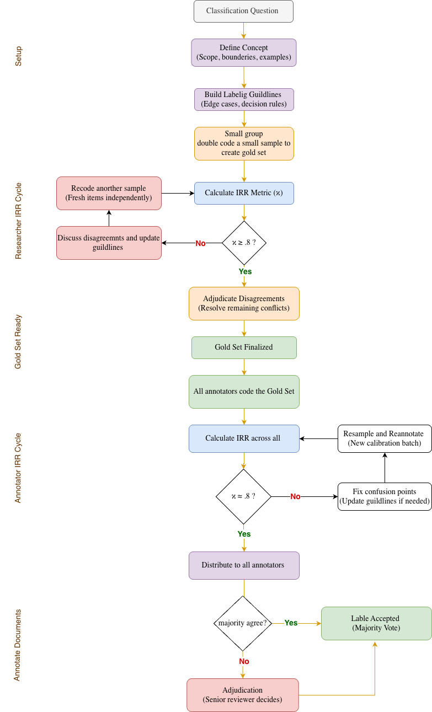

# Guide for labeling GAMI 2 data
**Author:** Ishita Gopal

**Date:** June 2026

# Concepts

Classification starts with **conceptualization**. Before we can label data or train or evaluate a model, we must clearly define what we are trying to detect.

This step is **essential** because if a concept is vague, different people will interpret it differently. That leads to inconsistent labels, and a machine learning model trained on inconsistent data will fail to learn a stable pattern. The same issue arises with large language models used for annotation or evaluation: if the concept is under-defined, LLM outputs will vary across prompts and settings, , making it difficult to distinguish whether disagreements come from model error or from an under-defined concept in the first place.

In short:
    **If humans don’t agree on the definition, the model can’t learn it either and evaluation itself becomes unreliable.**

## Below I show examples in increasing level of complexity
### Example 1: Good Movie

If we ask,

> Can you build a model that detects "good movies"?

Most people will say yes.
But then ask:

> What exactly is a "good movie"?

Possible answers may include:

- Oscar-winning films
- High box office revenue
- High critic ratings
- High audience ratings

We may choose one of these criteria or combine several criteria to define a good movie. Each definition would produce a different labeling rule—and therefore a different dataset.

So until the criteria for a “good movie” is clearly defined, neither humans nor models (including LLMs) will perform well, because both are trying to learn or apply a target that is still ambiguous.

The same challenge appears in text classification tasks such as sentiment analysis, misinformation detection, hate speech detection etc.

### Example 2: Political Advertising
Suppose we classify ads as:
- Attack
- Promote
- Contrast

Now consider this statement:
> "My opponent voted against education funding but I won't. I support education funding."

Without clear definitions, annotators may disagree:

- One coder labels "My opponent voted against education funding" as Attack.
- Another labels it as Contrast because the ad also says "I supported education funding."
- A third labels it as Promote because the focus seems to be on the candidate's own record.

Who is correct? Nobody knows, because the concept is underspecified.

With definitions:
- Attack = criticism of an opponent without positive self-comparison.
- Promote = positive statements about oneself without mentioning an opponent.
- Contrast = explicit comparison between self and opponent.

Now coders can apply the labels consistently, and a machine learning model can learn a stable pattern and we can evaluate with confidence.

### Example 3: Human Adaptation to Climate Change
This problem becomes even more difficult when the concept is inherently ambiguous, such as human adaptation to climate change.
Imagine the task is:
> Identify abstracts that describe human adaptation.

Now consider this sentence:
> “The government invested in new drainage systems to improve urban infrastructure, while also upgrading roads and expanding housing in flood-prone areas.”

Without a clear and shared definition of this concept, annotators may reasonably disagree:

- A labels it as adaptation, focusing on drainage systems and flood-prone housing.
- B labels it as neither, because there is no explicit mention of climate change as the driver.
- C labels it as uncertain, due to ambiguity in whether flooding is being framed as climate-driven or general infrastructure risk.

Who is correct? There is no stable answer—because the concept is under-defined.

*With definitions:*
- **Human Adaptation** = actions or measures taken in response to explicitly stated climate change impacts or climate-driven risks that aim to reduce harm, increase resilience, or adjust systems.
- **Not Adaptation (Impact-only / description)** = descriptions of climate-related conditions or risks without any response or action.
- **Not Adaptation (General development)** = infrastructure, policy, or development actions that are not explicitly linked to climate change or climate-driven risks in the text.
- **Not Adaptation (Mitigation)** = actions aimed at reducing greenhouse gas emissions or addressing causes of climate change rather than responding to its impacts.

Different interpretations of the same text lead to different labels, meaning the dataset reflects disagreement about the meaning of adaptation, not just differences in annotation. This is exactly why concept definition is a prerequisite for text classification: without it, the model is not learning a consistent target variable, but a mixture of subjective interpretations.

## Why this matters for training and/or evaluation of models

A classifier learns from examples. If humans disagree because concepts are vague, the training data becomes noisy.

|Situation|Result|
|:-------:|:----:|
|Clear concept + consistent labels | Model learns signal; Evaluation reflects real performance
|Vague concept + inconsistent labels| Model learns noise; Evaluation becomes unstable and hard to interpret|

Many classification failures are actually **measurement problems, not algorithm problems**.

# Creating a Coding Scheme + Validation
To ensure clear and reliable concepts, a coding scheme should be both well-defined and empirically validated.

This typically involves two linked steps:
1. Independent coding (by multiple coders using shared guidelines)
2. Validation via Inter-Rater Reliability (IRR)

# Why IRR is important
IRR provides evidence that the coding scheme is reliable and reproducible before any corrections are made.
It answers:

> "How much did coders agree before discussion or adjudication?”
> “If another team used the same codebook, would they produce similar labels?”
IRR directly addresses this concern.

## What IRR tells you
1. **Whether the task is well-defined**

    If coders frequently disagree (e.g., human adaptation vs not), it signals that:
    - categories may be ambiguous
    - instructions may be unclear
    - the coding task is inherently subjective

2. **How stable the codebook is**

    **High IRR** → coding rules are clear and consistently interpreted

    **Low IRR** → results depend heavily on individual coder judgment

    This is key for **generalizability**.

3. **Transparency of the measurement process**

    IRR provides evidence that the dataset is not just a set of resolved decisions, but a reproducible measurement system.
    Without it, you lose:
    - visibility into ambiguity in the task
    - evidence of reliability
    - comparability to other potential datasets

## IRR vs Adjudication

These serve different purposes:

- IRR: Measures whether coders naturally agree
- Adjudication: Produces the final gold-standard label when they don’t

A useful way to think about it:

- IRR asks: “Was this coding scheme reliable?”
- Adjudication asks: “What final label should we assign?”

## Proposed Annotation Workflow for labeling data for inclusion classification and taxonomy labeling:

**Phase 1 - Build a Gold Set**
- 2 researchers independently code a small pilot (100)
- Calculate Cohen's kappa (κ) as researcher baseline
- Update guidelines, re-code a fresh sample, recalculate κ each round
- Stop when κ plateaus (< 0.02–0.03 gain between rounds)
- Scale up coding to 300–500 items using finalized guidelines
- Build a gold set of 500 pre-labeled items

**Phase 2 — Annotator Training & Calibration**
- Share guidelines and worked examples with all annotators
- All annotators independently label a batch from the gold set (~100 items)
- Measure per-annotator accuracy against gold labels
- Calculate Fleiss' kappa as annotator baseline
- Identify weak spots and misunderstandings before remaining annotation begins
- If required, repeat with a fresh gold batch until annotators are aligned
- **The highest κ the annotators can realistically achieve is capped by what the researchers achieved** - if researchers plateaued at κ = 0.75, do not expect annotators to reach κ = 0.90
- **Use the researcher plateau κ to judge whether the annotators are performing well** - e.g. if researchers hit 0.75 and annotators reach 0.68, that is strong performance; if annotators are at 0.45, something is wrong with training or guidelines

**Phase 3 — Main Annotation**
- Assign 3 (or more) annotators per item
- Clear-cut items → majority vote (eg: ≥ 2/3 agree)
- Disputed items → adjudication by senior reviewer
- Adjudicated items tagged as "hard cases" for downstream LLM analysis
- If the target is to label a lot of documents (5-10K +):
    - Maintain 10–15% overlap to monitor annotator drift *
    - Re-run IRR every few hundred items to catch drift *
